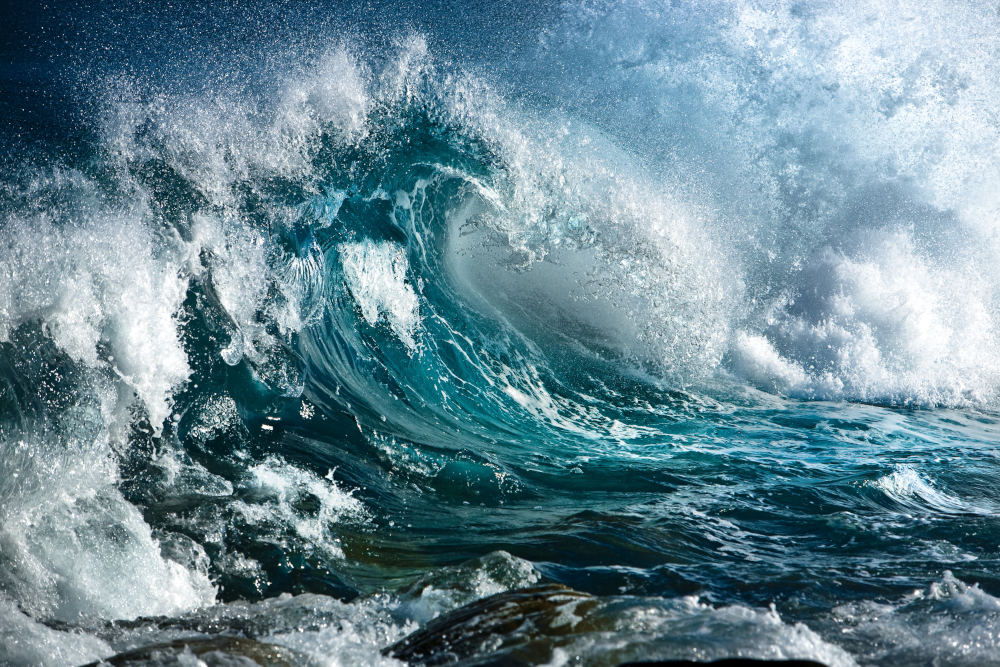
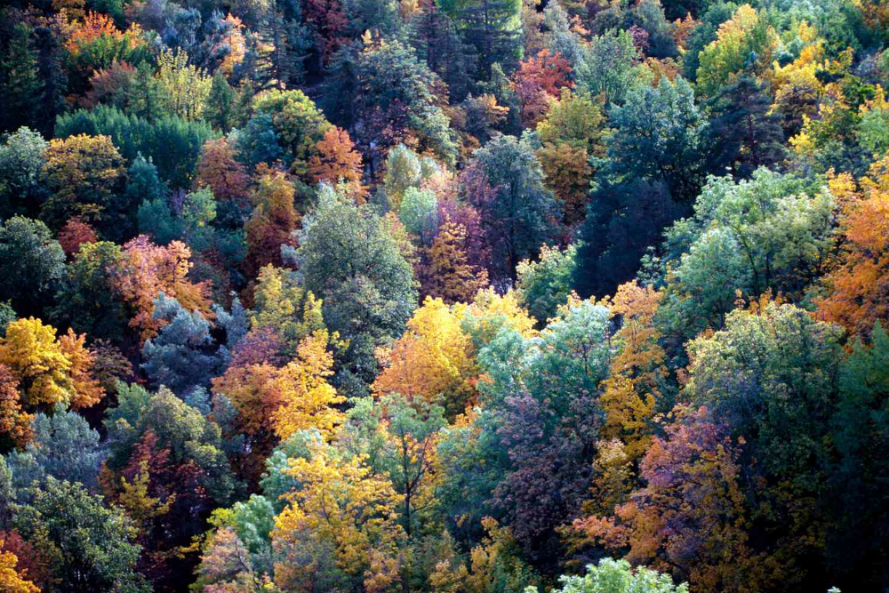
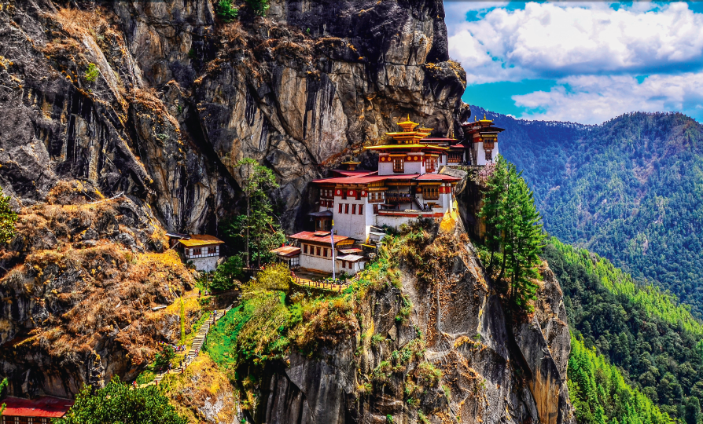
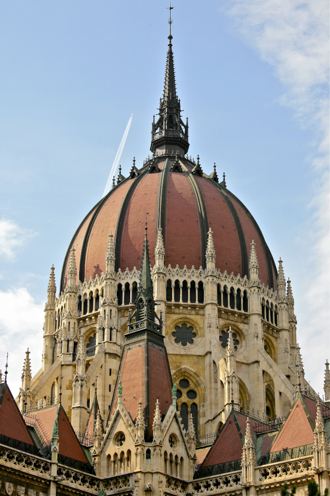
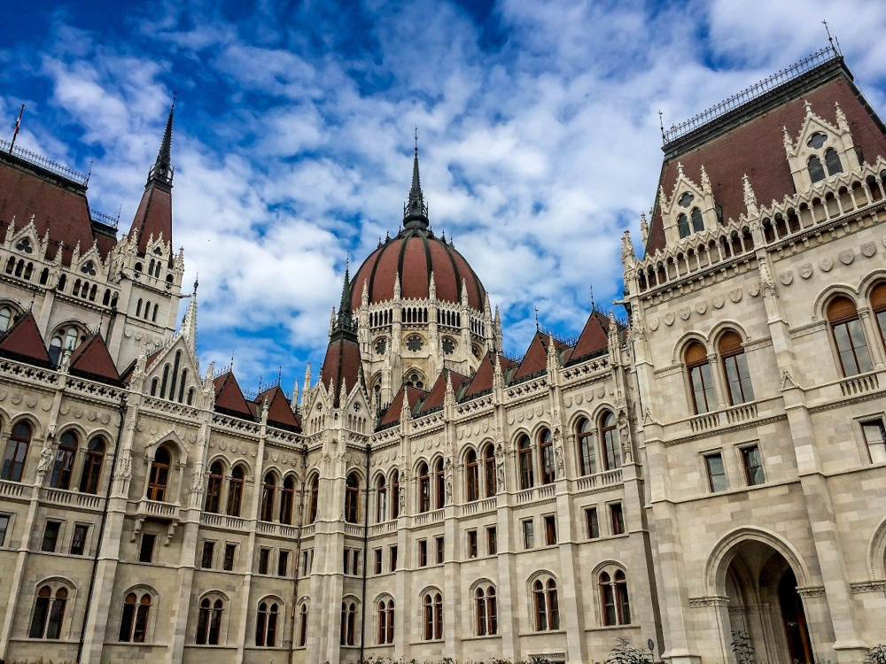

# pixmap-ops

Image manipulation demos based on the PPM image format.


## How to build

*Windows*

Open git bash to the directory containing this repository.

```
pixmap-ops $ mkdir build
pixmap-ops $ cd build
pixmap-ops/build $ cmake -G "Visual Studio 17 2022" ..
pixmap-ops/build $ start pixmap-ops.sln
```

Your solution file should contain two projects: `pixmap_art` and `pixmap_test`.
To run from the git bash command shell, 

```
pixmap-ops/build $ ../bin/Debug/pixmap_test
pixmap-ops/build $ ../bin/Debug/pixmap_art
```

*macOS*

Open terminal to the directory containing this repository.

```
pixmap-ops $ mkdir build
pixmap-ops $ cd build
pixmap-ops/build $ cmake ..
pixmap-ops/build $ make
```

To run each program from build, you would type

```
pixmap-ops/build $ ../bin/pixmap_test
pixmap-ops/build $ ../bin/pixmap_art
```

## Image operators

### Originals

     

### Rotate 90 Degrees


### Add Two Images


### Subtract Two Images


### Multiply Two Images


### Distance Between Two Images


### Swirl (Rotate Color Channel Values)

  

### Lightest Pixels of Two Images


### Darkest Pixels of Two Images


### Invert Colors


### Extract Color Channel

    

### Box Blur


### Glow-ish


### Bitmap Effect


### Sobel Edge Detection

  

  

---

### Resize


### Flip Along Horizontal Axis


### Flip Along Vertical Axis


### Subimage


### Gamma Correct

  

### Alpha Blend & Replace


### Grayscale


## Results

 


  

  

